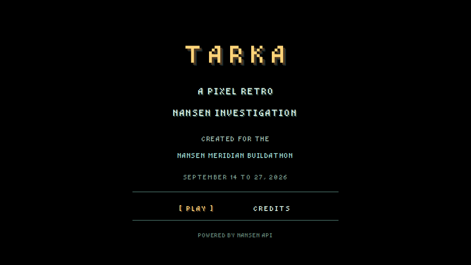
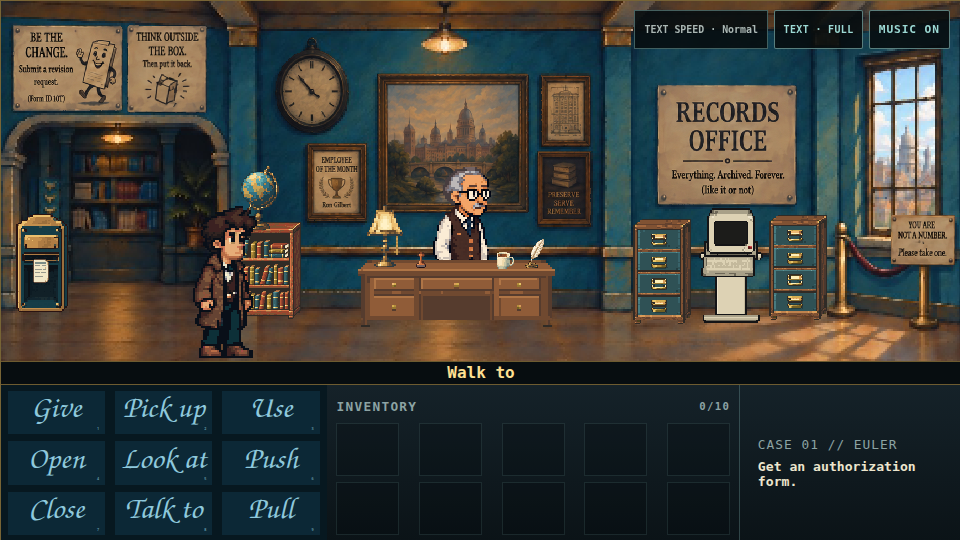

# TARKA

**A very public blockchain. A very private filing cabinet.**

Tarka is a complete pixel-art point-and-click mystery. Play as Rook, endure
Arthur the Archivist's paperwork, and turn real historical Nansen-derived
Euler evidence into a case you can actually follow.

[Play Tarka](https://play.tarka-meridian.workers.dev/) ·
[Documentation](https://docs.tarka-meridian.workers.dev/) ·
[Release downloads](https://github.com/th3Wh1t3Rabbit/tarka/releases/tag/v1.0.0-meridian) ·
[Creator's note](docs/creator-note.md) ·
[Request catalog](docs/data/request-log.md) ·
[Creator on GitHub](https://github.com/th3Wh1t3Rabbit) ·
[Creator on X](https://x.com/th3Wh1t3Rabbit) ·
[Buy Me a Coffee](https://buymeacoffee.com/th3Wh1t3Rabbit)

No crypto expertise is required. Curiosity helps. So does reading the form
before signing it.

## Screenshots





The same complete 16:9 scene is available in fitted mobile full screen:
[view the mobile presentation](docs/images/tarka-mobile-fullscreen.png).

## Explore, experiment, and click the weird combinations

The direct route solves the case, but it is not the whole game. Try different
verbs on the scenery, use unlikely inventory combinations, talk to things that
clearly cannot answer, and revisit objects as the case changes. A substantial
amount of optional dialogue, jokes, callbacks, and inside jokes is hidden in
those interactions.

## Run locally in under ten minutes

Requirements: Node.js 20.19 or later and npm 10 or later.

```bash
git clone https://github.com/th3Wh1t3Rabbit/tarka.git
cd tarka
npm ci
npm run dev
```

Open the local address printed by Vite. No API key, backend, wallet, external
media host, or runtime provider connection is required.

To build and inspect the exact static production form:

```bash
npm run release:verify
npm run preview
```

## Controls

- Click the scene to walk.
- Select one of the nine verbs, then select a hotspot.
- For `USE` and `GIVE`, select an inventory item before the hotspot.
- Right-click or `Escape` cancels the current command.
- Click, `Space`, or `Enter` reveals and advances dialogue.
- Number keys `1`–`9` select verbs in display order.
- On phones, use the visible full-screen icon for immediate fitted playback;
  the adjacent menu contains text, music, and the exit-full-screen control.
  Full screen requests landscape when the browser permits it and otherwise
  letterboxes the complete game in portrait. Outside full screen, swipe
  horizontally or pinch-zoom the native pixel-art canvas as needed.

See the [player guide](docs/controls.md) for the full interaction model.

## How Nansen is used

Nansen data is not decorative. Historical Nansen-derived records determine the
questions, candidate trails, contradiction, falsifier, and exact proof used by
the case. Ordinary browser play uses a reviewed, frozen competition corpus.
The shipped game performs **zero live provider calls** and contains no Nansen
credential.

Read [Nansen integration and evidence boundaries](docs/nansen-integration.md)
for the precise runtime and claim boundary.

## Production and hosting

- Build command: `npm run build`
- Output directory: `dist`
- Required runtime environment variables: none
- Required backend services: none
- Intended hosting: origin root with an `index.html` SPA fallback

`npm run release:verify` builds the game, checks the browser boundary, verifies
required runtime assets, confirms public files enter `dist` byte-for-byte, and
rejects machine-local filesystem dependencies in the generated site.

## Documentation

- [Documentation index](docs/index.md)
- [Creator's note](docs/creator-note.md)
- [101-request catalog](docs/data/request-log.md)
- [Player guide](docs/controls.md)
- [Platforms and browser support](docs/platforms.md)
- [Architecture](docs/architecture.md)
- [Production animation assets](docs/animation-assets.md)
- [Nansen integration](docs/nansen-integration.md)
- [Testing and release qualification](docs/testing.md)
- [Known limitations](docs/limitations.md)
- [Credits and third-party notices](docs/credits.md)
- [Complete Script Explorer](docs/script/index.md)
- [Script Explorer coverage proof](docs/script/coverage.md)

## License

The first-party software code and technical documentation are available under
the [MIT License](LICENSE-CODE-MIT.md). Tarka's artwork, animation, music,
narrative, dialogue, characters, logos, and branding use the separate
[Tarka Content Terms](LICENSE-CONTENT.md). See [LICENSE.md](LICENSE.md) and the
[rights manifest](RIGHTS_MANIFEST.md) for scope.

Created by **th3Wh1t3Rabbit** for the Nansen Meridian Buildathon.
