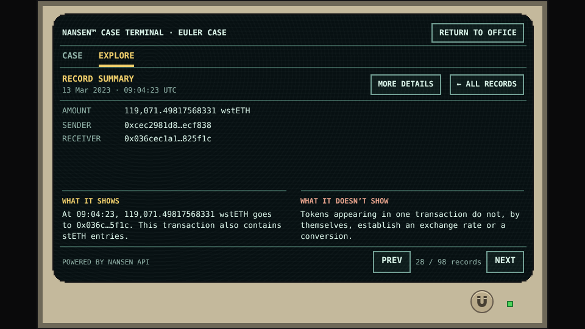
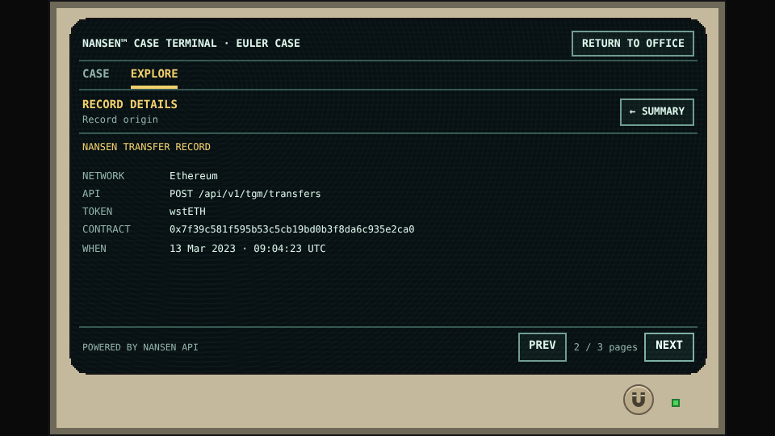
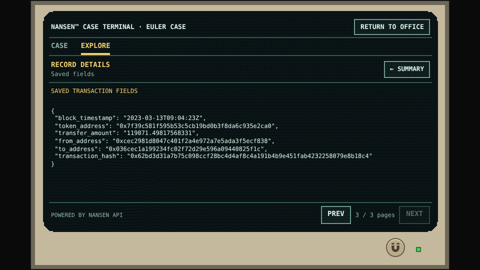

# Worked example: one request, one readable transfer

This example follows a wstETH movement from its recorded research question to a game summary. It illustrates the assembly method without revealing the main case’s solution.

## The question came first

[Request RQ-098](requests/RQ-098.md) asks which wstETH transfers entered the address known in the case as the Extraction Engine during the incident window. Its endpoint family is **POST /api/v1/tgm/transfers**.

The retained index links this request to three selected transfer records. One is [REC-197](records.md#rec-197). Its recorded fields are:

| Field | Retained value |
|---|---|
| Event time | 13 March 2023, 09:04:23 UTC |
| Token | wstETH |
| Token contract | `0x7f39c581f595b53c5cb19bd0b3f8da6c935e2ca0` |
| Amount | `119071.49817568331` |
| Sender | `0xcec2981d8047c401f2a4e972a7e5ada3f5ecf838` |
| Receiver | `0x036cec1a199234fc02f72d29e596a09440825f1c` |
| Transaction | `0x62bd3d31a7b75c098ccf28bc4d4af8c4a191b4b9e451fab4232258079e8b18c4` |

These are retained selected fields, not a fabricated reproduction of the complete API response. The original request-body and response fingerprints are linked from the request page. The exact request JSON still requires the original execution-log join described in the [catalog](request-log.md).

## The assembly does not need several calls here

This individual example has a direct association with one request in the retained index. That request contributes three selected records; it is not one call per transfer. We do not claim that an address profiler call or a price query was merged into this particular record without an explicit source association.

## What the summary keeps

The summary preserves the amount, token, time, and direction, abbreviates the addresses for legibility, and keeps the full identifiers available in Details. Token identity comes from the contract; it is not guessed from the size of the amount.

When the player is asking about the file’s DAI clue, the useful explanation is that this movement concerns **wstETH, not DAI**. A dramatic-looking quantity in the wrong token does not satisfy the question. Before the file is obtained, the explanation should remain neutral rather than leaking that ranking.

The observation and its limitation are produced from the record and the player’s known question. Neither requires a live language-model response during play.

## What is deliberately not inferred

The address nickname is not a person’s identity. The amount is not converted into a new historical valuation merely to make a comparison easier. The fact that this record is useful context does not make it eligible to complete the final DAI proof.

## See the same record at each level

*Terminal reference · The selected transfer becomes a concise summary. Its timestamp and exact amount match the retained table above.*

*Terminal reference · MORE DETAILS keeps the source association with this transfer and identifies the token by its contract.*

*Terminal reference · The saved-fields page exposes the retained values. This selected record is not represented as the full original provider response.*

These are captures of the unchanged terminal reference being integrated into the game. Original execution metadata still needs the retained-log join described in the catalog; the screenshots do not supply missing request parameters.

[Return to the method](method.md) · [Follow the connection example — spoilers](../spoilers/euler-connection.md)
