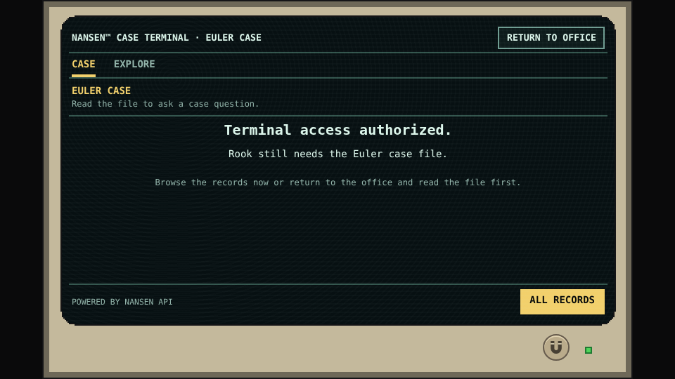

# Nansen at the centre of the investigation

The game was designed around Nansen’s data and the questions it makes practical to ask. The terminal is not a generic adventure puzzle with an API logo added afterward.

Token-transfer requests supply movement-oriented views. Address-transaction requests provide activity around a specific subject. Counterparty requests add bounded address relationships. Their schemas differ, but the player needs one consistent vocabulary: a question, conditions, matching records, a relevant relationship, and a claim that can be checked.

*Terminal reference · Access to the records is not yet an investigative question. The file provides the missing case context.*

## Research once, investigate locally

The research uses authenticated Nansen API requests and retains their source associations. The game then runs on a frozen, selected collection. A player’s RUN QUERY searches those saved records; it does not issue a fresh Nansen request. This makes the historical puzzle reproducible, avoids exposing a provider key, and keeps ordinary play independent of provider latency or a per-player API bill.

Freezing the game does not turn its data into fiction. It fixes the evidence available to the investigation. Conversely, a contemporary market snapshot cannot silently become evidence about the 2023 Euler event.

## Follow the evidence at your preferred depth

Start with [how the case was chosen](discovery.md), then follow the [collection and compilation method](method.md). The [record-assembly example](assembly.md) connects a documented request to selected fields and a player-facing explanation. The [Euler connection analysis](../spoilers/euler-connection.md) reveals the solution and shows which joins support it.

The [101-entry request catalog](request-log.md) and [227-entry compiled register](records.md) provide the detail behind those explanations. The [count guide](counts.md) explains why those numbers differ from the terminal’s 98 records.

**Powered by Nansen API.** Exact case-transaction references are separately checked; a contextual API view of the same transaction is not automatically a substitute for that evidence.
