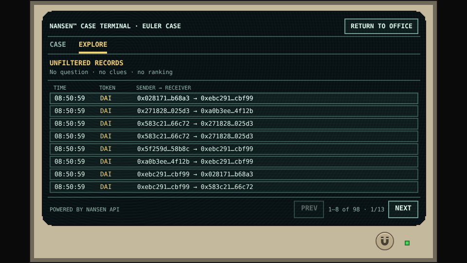
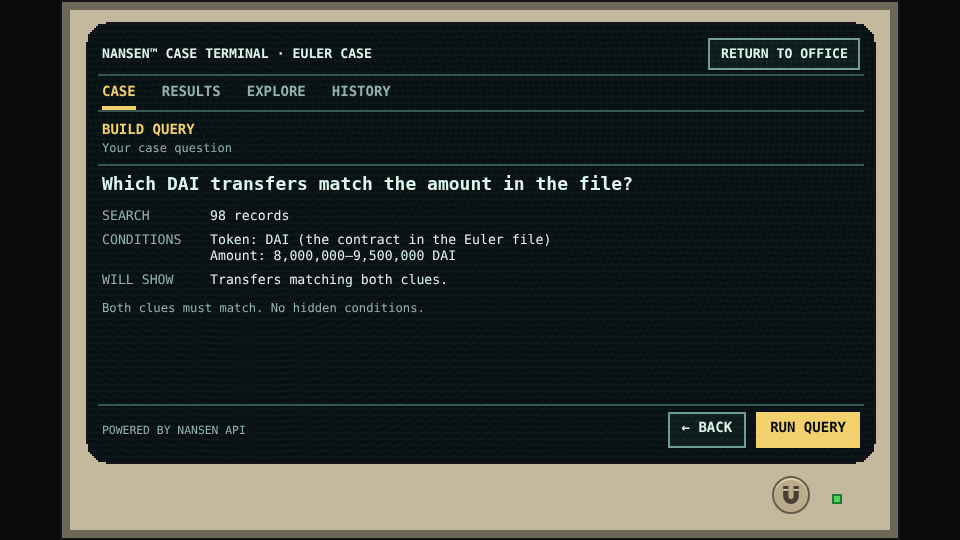

# Questions before dashboards

## A different way to look at the same data

Tarka began with a design question as much as a game idea: could an adventure help someone change how they see and navigate data?

The aim was not to hide detail, or to claim that a tiny screen is universally better. It was to separate **what is available** from **what matters to the question being asked**. An accurate dataset can still be difficult to use when every field, control, and possible action competes for attention.

The terminal offers this mental model:

**Question → explicit conditions → matching records → comparison → supported conclusion.**

The data does not change when the question changes. Its relevance does.

## 393 × 219 pixels, chosen on purpose

The complete monitor composition is 480 × 270 logical pixels. Its usable opening, inside the bezel, is **393 × 219 logical pixels**. Navigation, fields, explanations, and actions share that space. Some of the available viewport was deliberately given to the old monitor itself.

That is a willing compromise for an early-’90s-style adventure, not a modern dashboard dropped into a decorative frame. It prevents solving every design problem by adding another panel, a large dropdown, a longer table, or more screen real estate. The design has to decide what belongs here and what can wait until the player selects a record.

*Terminal reference · The whole monitor is shown at 2× its logical size. The usable content opening is 393 × 219, not the full 480 × 270 composition.*

## Three levels of attention

**A question supplies direction.** The file’s token and approximate amount become explicit conditions before the search runs. A guided question lowers the entry barrier without requiring a player to type a contract address or learn an endpoint schema.

*Terminal reference · The earned clues are visible as conditions. Both must match; the terminal adds no hidden condition.*

**A summary supplies meaning.** A record is more than a pile of fields. Its explanation relates the time, token, amount, and address relationships to the current inquiry. Before case context is known, the same record remains neutrally described rather than ranked as an answer.

*Terminal reference · This transaction contains wstETH and stETH entries. That observation does not, by itself, prove a conversion or exchange rate.*

**Details supply inspection.** The explanation does not replace the evidence. Full identifiers, retained fields, and source associations remain attached to the selected record. The player can inspect them and return without losing the query, page, or place in the list. The [worked example](../data/assembly.md) follows those layers for this exact record.

## Guided inquiry and open exploration belong together

CASE provides direction. EXPLORE lets a curious player ask another supported question or browse the whole collection. These are views of one investigation, not separate engines with separate answers. The [terminal guide](terminal-tour.md) owns the practical navigation instructions.

Explanations must also distinguish observations from stronger claims. Two views are not necessarily independent confirmation, similar amounts do not identify an owner, and no match in a bounded collection does not establish universal absence. The full set of [evidence limits](../data/evidence-limits.md) applies regardless of the presentation.

## What builders can take from this

The screen size is specific to Tarka; the habits are not. Make the active question visible. Show the conditions that changed the results. Separate a useful observation from a stronger conclusion. Offer detail after selection, and preserve a reader’s place when they return.

The invitation is not to replace every analytical tool with an adventure. It is to ask whether clearer inquiries, fewer competing choices, and context-sensitive explanations would make your own dashboards and data exploration easier to reason about.

[Read the creator’s note](../creator-note.md) · [The terminal’s visual character](terminal-character.md)
