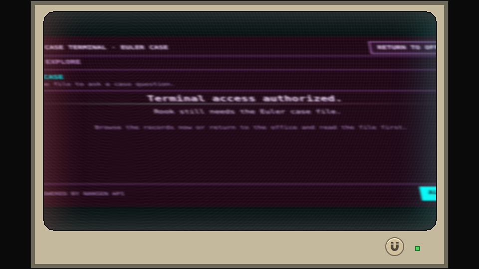

# A terminal with character

The monitor belongs in the Records Office. Its pixel frame, limited space, restrained palette, scanlines, and brief signal imperfections support the fiction rather than creating another modern dashboard.

## Presentation is not evidence

The horseshoe magnet activates a short degauss effect: a sharp deformation and colour separation settle back into place. Overscan is clipped beneath the bezel. It is a cosmetic interaction, not a query, clue, refresh of blockchain data, or reset of the investigation.

*Terminal reference · A still from the early part of the reference degauss animation. The distorted image remains inside the monitor opening; a still image cannot demonstrate the audio mix.*

The intended sound design uses separate office and terminal music. The selected background track follows whether the terminal is actually open, not which tab is selected. A manual degauss sound accompanies the button; the reserved sound-only overlay at terminal music-loop boundaries does not automatically distort the picture.

The production game switches between the office and terminal tracks, plays the
degauss effect only after a player gesture, cancels obsolete transitions, and
uses the separate case-closed track after successful closure. The figure above
is a silent reference image; audio behavior is verified by the integrated game
suite rather than inferred from a still.

The [design rationale](questions-first.md) explains the spatial constraints. [Credits and licenses](../credits.md) records the separate audio and artwork rights requirements.
