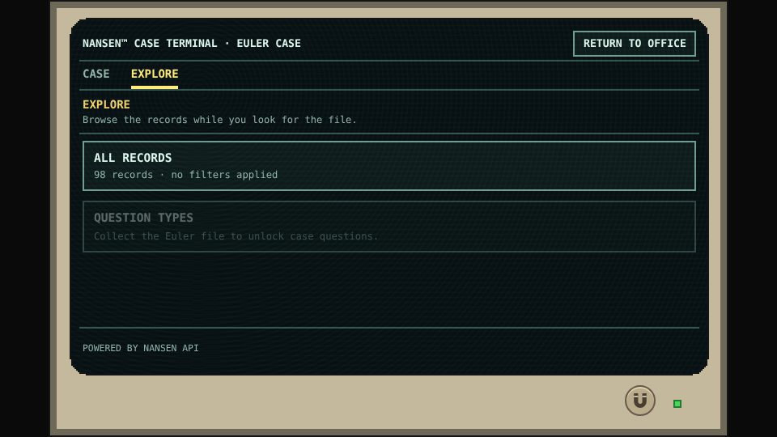
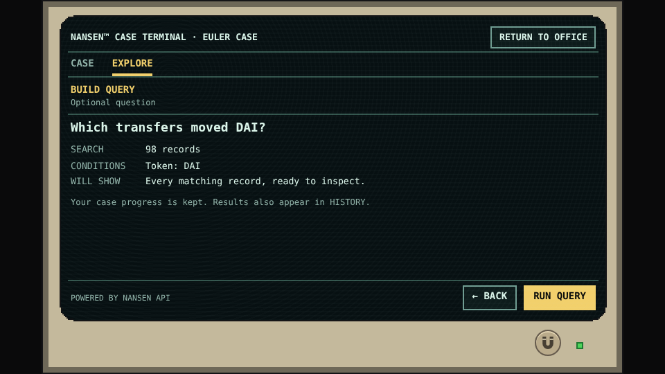
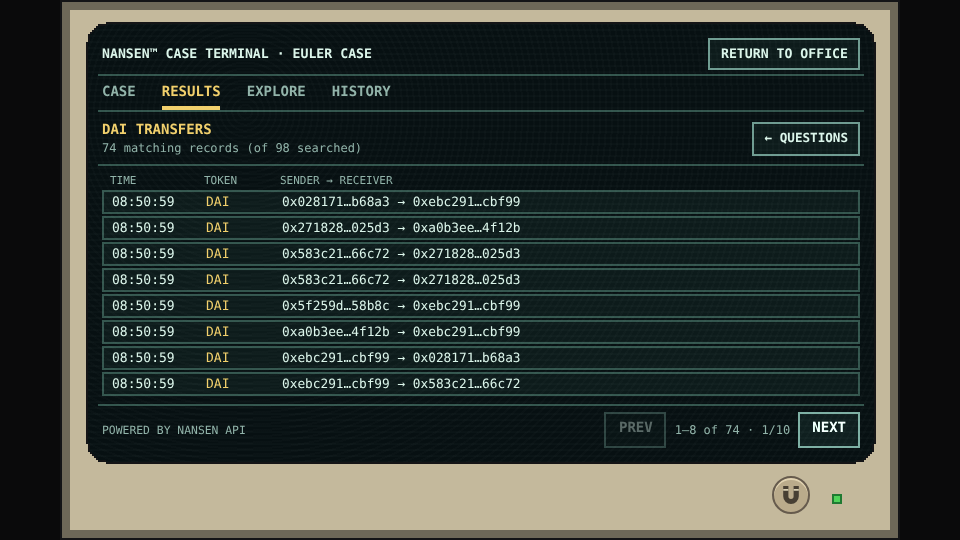
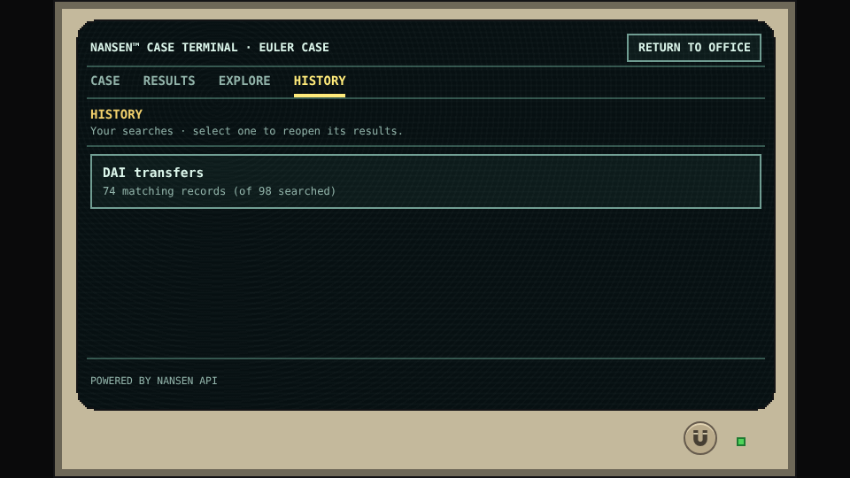

# A tour of the terminal

This is the practical guide to the terminal’s controls. It uses an optional DAI search rather than revealing the main connection. For the rationale behind the design, see [Questions before dashboards](questions-first.md).

## Know which view you are in

| View | Use it for |
|---|---|
| **CASE** | The current question and the clues or findings you have saved. |
| **RESULTS** | The complete matches from the selected search. |
| **EXPLORE** | All Records and additional questions unlocked by what you know. |
| **HISTORY** | Searches you actually ran; select one to reopen its result. |

Before the Euler file is collected, you can browse the collection but cannot yet ask the file’s case questions. The disabled Question Types tile explains what unlocks it. Acquiring the file adds context; it does not replace or remove All Records.

*Terminal reference · Data is available before Rook has the case context. The locked control states what is missing.*

## Read the question before running it

A query review states the search pool, conditions, and expected result. In this example, “Which transfers moved DAI?” applies a token condition to 98 saved records. It is a local search of the collection, not a new request to Nansen.

*Terminal reference · The question and its explicit condition precede RUN QUERY.*

## Browse every match

The result heading tells you what changed: **74 matching records out of 98 searched**. Every match remains available through the paginator. PREV and NEXT are disabled where there is no previous or next page.

*Terminal reference · The visible count belongs to this saved query. Paging does not change the question or the case.*

Select any row to open its summary. PREV and NEXT inside a record traverse that same collection; returning to the list restores the relevant page. **MORE DETAILS** opens the selected record’s retained fields and origin, and **SUMMARY** returns to that record. Nothing is added to CASE by browsing alone.

A matching record is an answer to a filter, not automatically evidence sufficient to finish the case. SAVE TO CASE, when offered, keeps a clue for comparison or testing. It is not the same action as confirming a connection.

## Return without starting over

HISTORY reopens a search without issuing it again. If you explore another question and then return to CASE, your earned clues and investigation goal remain intact.

*Terminal reference · Only an executed optional search appears here; history is not a list of future steps.*

The case report collects the facts you have confirmed. Saving it leaves the case open for further inspection. Closing is a separate confirmation. The [solution analysis](../spoilers/euler-connection.md) shows that final sequence with spoilers.

[Inspect a single record’s construction](../data/assembly.md) · [Image provenance](../project/figures.md)
