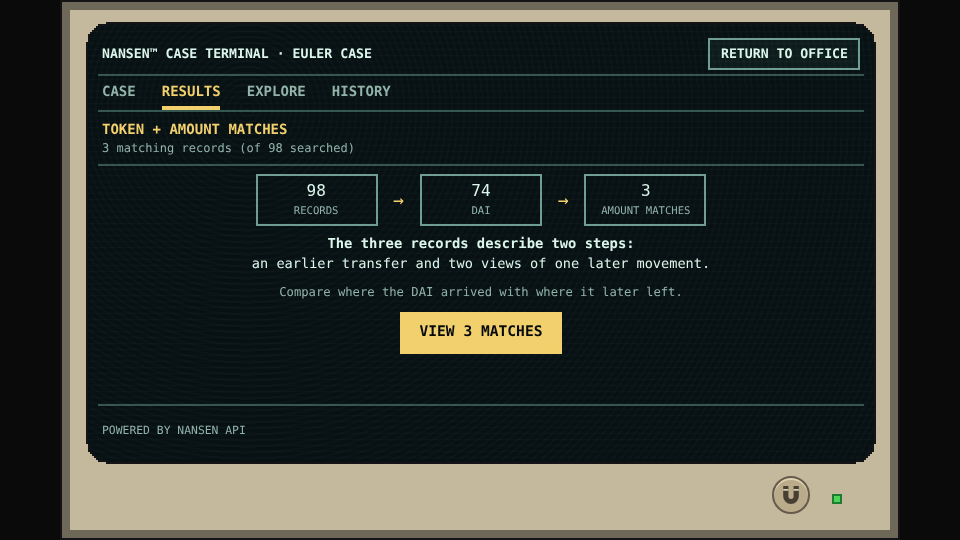
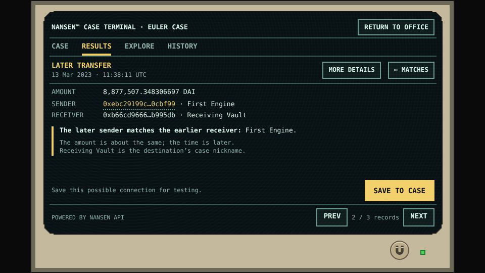
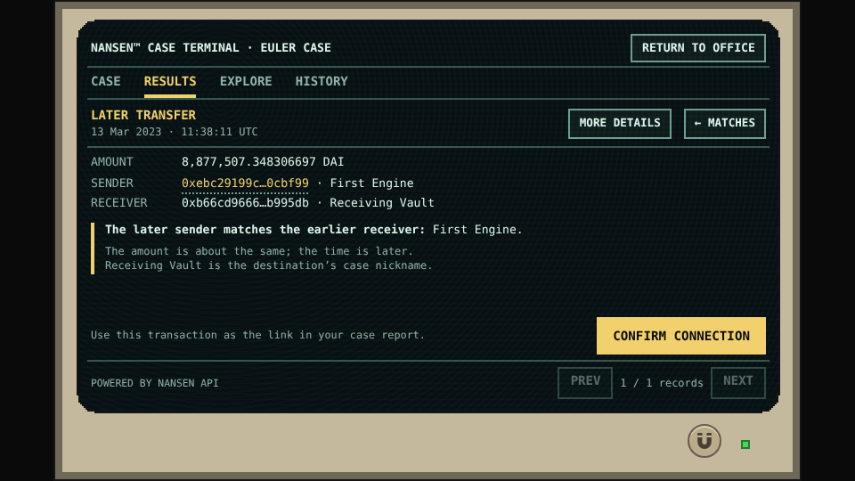
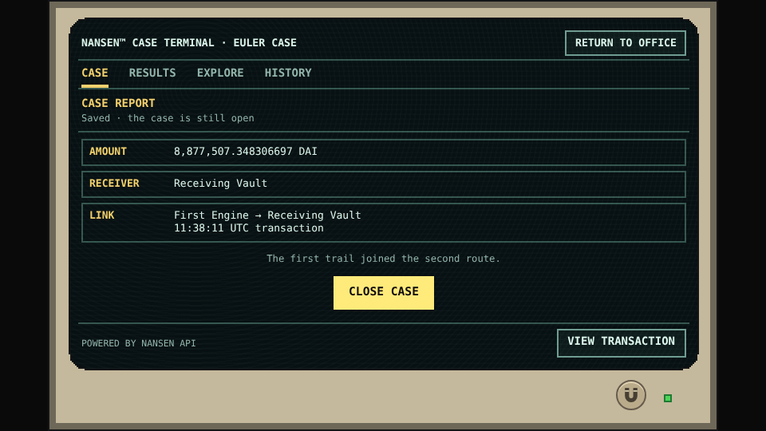

# How the Euler records connect

> **Spoiler warning:** this page reveals the main investigation’s connection and conclusion. [Return to the spoiler-free guide](../controls.md).

## First, narrow the question

The file identifies DAI and approximately 8.88 million. The first useful guided query requires the DAI contract and an amount between 8,000,000 and 9,500,000 DAI. In this selected collection the count changes from **98 records to 74 DAI records to three amount matches**.

Those matches are not three different exits. They include an earlier movement and two views of the later connection. Multiple views must not be counted as multiple payments.

*Terminal reference · The token and amount conditions narrow the collection in two explained steps.*

## Compare the recorded steps

| Check | Earlier transfer | Connecting transfer |
|---|---|---|
| Time | 13 Mar 2023, 08:50:59 UTC | 13 Mar 2023, 11:38:11 UTC |
| Amount | 8,877,507.3483067 DAI | 8,877,507.348306697 DAI |
| Sender | Early Trigger | First Engine |
| Receiver | First Engine | Receiving Vault |

The earlier receiver is the later sender: `0xebc29199c817dc47ba12e3f86102564d640cbf99`. The later receiver is `0xb66cd966670d962c227b3eaba30a872dbfb995db`.

The decimal strings are retained as recorded. Their precision differs; they are not silently rewritten to identical text. Similar size helps identify the candidate relationship, but the transaction reference and direction establish the recorded link.

*Terminal reference · The first transfer’s receiver is the address given the case nickname First Engine. It is not a person’s identity.*

*Terminal reference · The same address appears as the later sender. The amounts keep their original precision, rather than being rewritten into identical strings.*

## How the source views are assembled

[Request RQ-026](../data/requests/RQ-026.md) contributes the contextual transfer [REC-026](../data/records.md#rec-026). Its archived question concerns DAI entering the Receiving Vault around the later interval. The returned selected record is timestamped **11:38:11 UTC**. The original request parameters are required to establish the precise inclusive boundary; a prose question saying “after” is not a substitute for them.

The separate checked transaction reference [REC-206](../data/records.md#rec-206) shares this hash:

`0xdae809e4a1ddf77c39d44a4acfe6165bedbc19a385c4b241242cc9bd582a80b9`

The compiler can associate the contextual view with that checked transaction using the hash and matching transfer fields. **It does not promote the contextual view to exact proof just because the hash matches.** The checked reference retains its own authority.

The committed provenance graph supplies the checked reference's own verification source:

| Verification field | Retained value |
|---|---|
| Evidence ID | `EXACT_CONVERGENCE` |
| Source lineage | `NANSEN_CONVERGENCE_TX_TRANSFERS` |
| Endpoint | `/api/v1/transaction-with-token-transfer-lookup` |
| Retrieved | `2026-09-15T04:44:30.582Z` |
| Raw SHA-256 | `e5f2d6701598192b560a1f179fedc7450bcf3d00588a2efcd564f80963c32e32` |
| Normalized SHA-256 | `c868921b09f3e409c08149a7b8ae94279411c4564e7f2a6fe1df51d08293c1e5` |
| Grade / independence | `EXACT_EVENT`; independent for proof |

This exact-source join comes from `public/scenarios/euler-2023-false-exit/evidence-graph.json` in committed tree `e98ce61f2efe720104a65e06ef2b688a99bc9f52`. It does not expose raw provider data and does not treat RQ-026, RQ-027, or RQ-056 as the authority for the exact grade.

The source comparison is concrete:

| Research view | Request | Linked documentation record | What it contributes |
|---|---|---|---|
| Token-centred incoming transfer | [RQ-026](../data/requests/RQ-026.md) | [REC-026](../data/records.md#rec-026) | DAI amount, direction, time, and the connecting hash |
| Address-centred activity | [RQ-027](../data/requests/RQ-027.md) | [REC-027](../data/records.md#rec-027) | Subject participation and a sent-token view of the same transaction |
| Hash-specific source comparison | [RQ-056](../data/requests/RQ-056.md) | [REC-220](../data/records.md#rec-220) | Records the comparison with the previously contributed facts and checked reference |

The address-activity view retains its unzoned timestamp and signed sent-token value; it is not silently relabelled as a new exact UTC observation. The transfer and checked-reference views retain their own temporal classifications.

RQ-026 and RQ-056 have different request-body fingerprints but the **same retained response and normalized-result fingerprints**. In this index the latter contributes a provenance comparison, not another transfer. This is why three source perspectives can improve navigation and auditability without increasing the number of events or making contextual evidence independently decisive.

## What the second query establishes

The final guided query takes the **three amount matches**, checks the First Engine → Receiving Vault route, and identifies the checked transaction reference: **three → two route views → one exact receipt**. A supporting entry cannot replace it.

The case’s independently checked main receiving event at 09:12:23 UTC establishes the second route’s destination. Together with the later connection, this supports the conclusion:

**THE FIRST TRAIL JOINED THE SECOND ROUTE.**

*Terminal reference · The transaction is still subject to explicit connection confirmation. Inspecting supporting information is not confirmation.*

## What “cracked the case” means here

The game saves amount, receiver, and link as the report’s facts. That establishes route convergence within the recorded cutoff. It does not establish common human control, offchain coordination, intent, or the ultimate destination of all later value.

The educational payoff is therefore not a dramatic accusation. It is a smaller, well-supported conclusion reached by comparing the right fields and knowing which evidence is sufficient.

*Terminal reference · The report is saved but the case remains open. Closing is a separate player decision.*

[Evidence limits](../data/evidence-limits.md) · [Return to the terminal guide](../design/terminal-tour.md)
